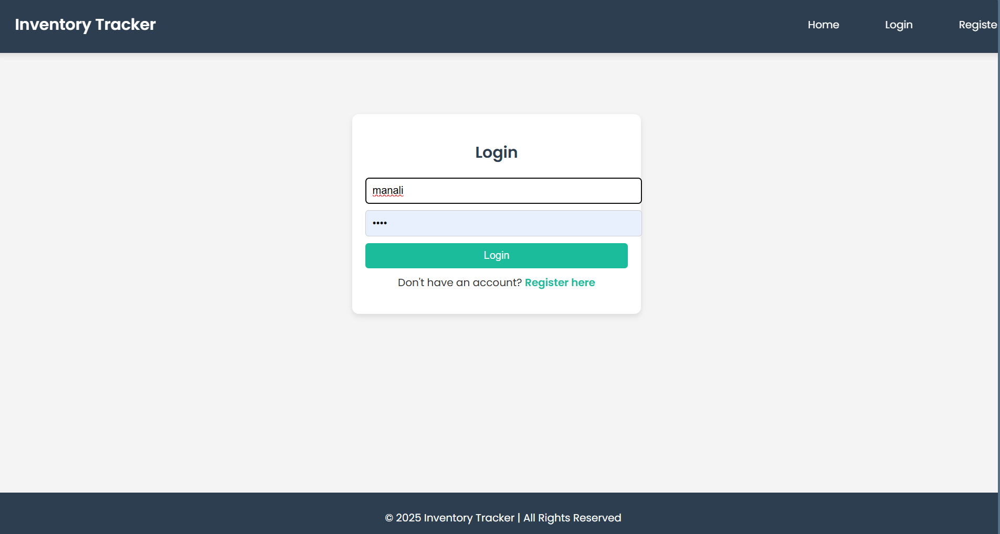
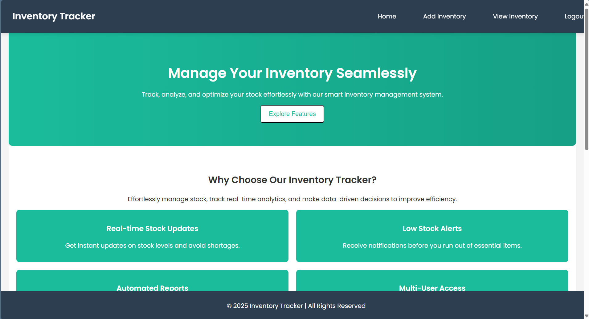
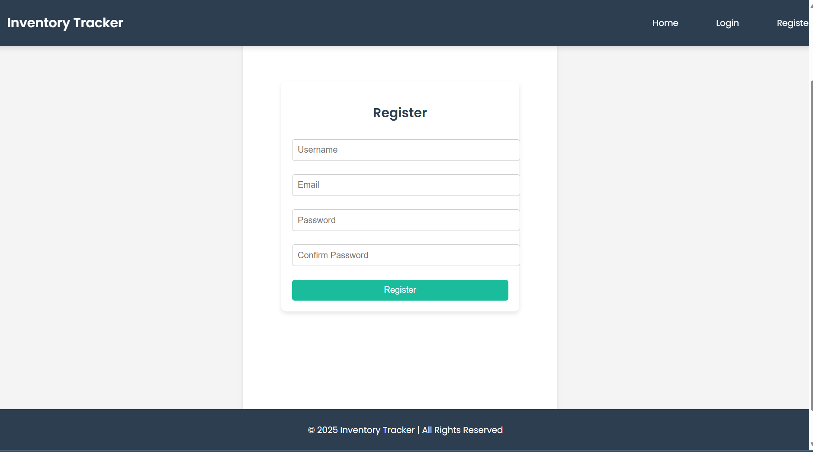
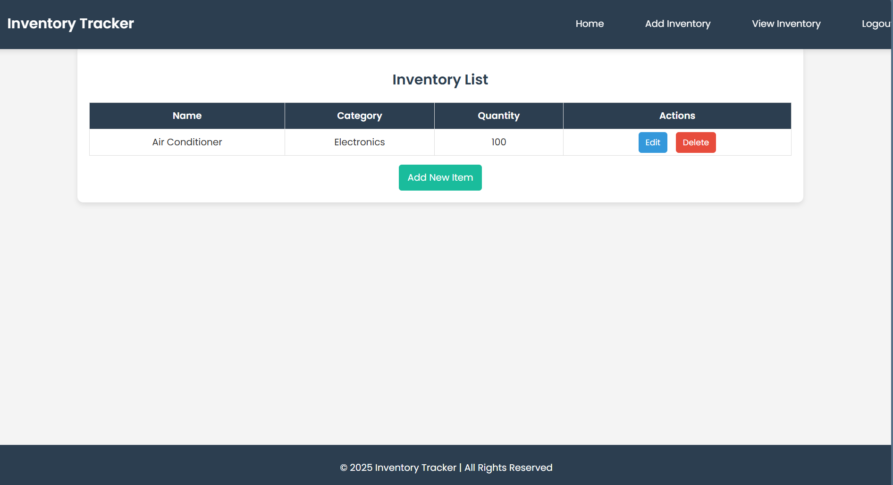
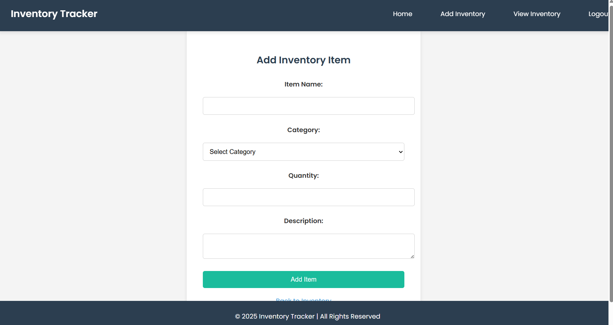

# Inventory Tracker

## Overview
This project is an Inventory Tracker application that allows users to manage their inventory efficiently.

## Features
- User authentication (Login and Register)
- View Inventory
- Add Inventory Items

## Screenshots
### Login

### Home

### Register

### View Inventory

### Add Inventory Items

## Installation
1. Clone the repository
2. Install the required packages using `pip install -r requirements.txt`
3. Run the application

## Usage
- Navigate to the login page to access your account.
- Register a new account if you do not have one.
- Manage your inventory from the home page.

## License
This project is licensed under the MIT License.
